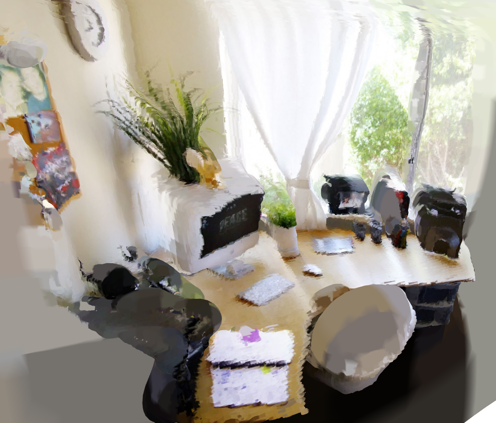
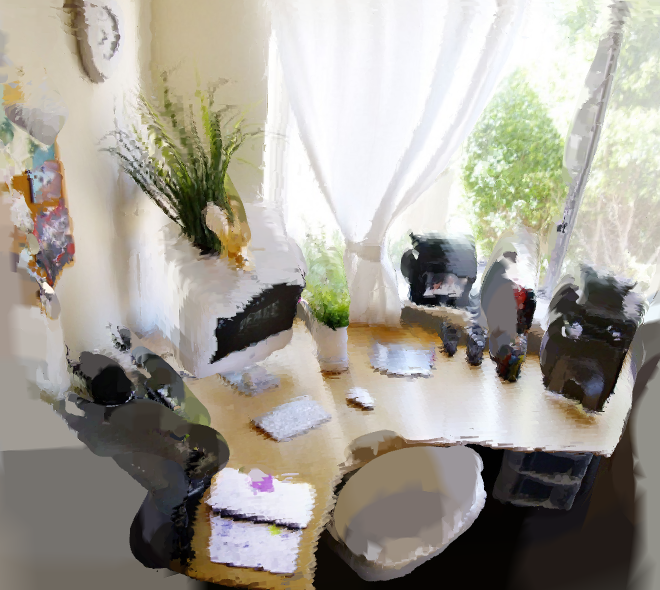

# 2D to 3D Point Cloud Image Generator

This small project utilizes Hugging Face pretrained models to generate a 3D point cloud image from a 2D image. Then use it to generate a 3D mesh.

## How to Use

1. **Setup Environment:**
   - Create a virtual environment for the project.
   - Install all the necessary packages using the following command:
     ```
     pip install -r requirements.txt
     ```

2. **Run the Project:**
   - After installing the required packages, you can run the project using the following command:
     ```
     python main.py --image_path "path/to/2D/image" --save_path "path/to/save/3D/image"
     ```
     Replace `"path/to/2D/image"` with the actual path to your 2D image file, and `"path/to/save/3D/image"` with the desired path to save the generated 3D point cloud image.

3. **Example:**
   ```bash
   python main.py --image_path "/From2Dto3D/input/desk-plants.jpg" --save_path "/From2Dto3D/output"
## Input image:
  

## Output image:
  
  

4. **Note:**
    This output can be enhanced by using better models and more processing methods. 